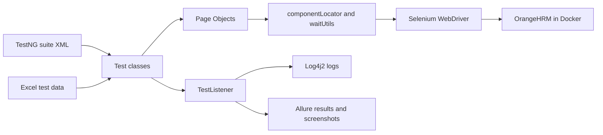

# OrangeHRM Automation Framework

A graduation project for practicing automated testing against a self-hosted OrangeHRM Open Source demo. The current source contains Java/Selenium UI tests organized with TestNG and Page Objects. API automation with Rest Assured is the next workstream; that dependency and API test classes are not present in this repository snapshot yet.

## Project at a glance

| Area | Technology | Use in this project |
|---|---|---|
| Language | Java 21 | Test code and framework utilities |
| Browser automation | Selenium WebDriver 4.48.0 | Chrome and Firefox UI automation |
| Test runner | TestNG 7.12.0 | Test methods, suites, listeners, and data providers |
| Build | Maven, Surefire 3.5.2 | Dependency management and suite execution |
| Logging | Log4j2 2.24.3 | Console and `logfile.log` output |
| Test reporting | Allure TestNG 2.29.0 | Test results, labels, and failure attachments |
| Spreadsheet data | Apache POI 5.2.5 | Reading `.xlsx` data for data-driven tests |
| Demo environment | Docker Compose | OrangeHRM, MariaDB, and Allure Docker Service |
| API automation | Rest Assured | Planned/in progress; not yet implemented in this source snapshot |

The UI source currently contains **40 TestNG test methods** with OHR identifiers. Methods using a `DataProvider` run once for each data row, so the total number of executions can be higher than 40.

## UI coverage

| Module | Scenarios in the source |
|---|---|
| Login | Valid login, data-driven invalid login, password reset flow |
| Admin | System users, job titles, locations, and skills; add, edit, search, and delete flows |
| PIM | Add, search, edit job/salary/supervisor details, terminate, and delete employees |
| Recruitment | Add/search/delete vacancies; add, reject, and delete candidates |
| My Info | Personal details, contact details, emergency contacts, and dependents |
| Performance | Add, write, and delete a performance review |

Data-driven tests read cases from `src/test/resources/data/Datadriven-OrangeHrm.xlsx`. The current providers use the `loginFail`, `Search`, `Search Location`, `Employee`, and `Vacancy` sheets.

## How the framework is organized



| Component | Responsibility |
|---|---|
| `TestBase` | Starts a browser before each test method, opens the configured URL, and closes the browser afterward |
| `WebDriverFactory` | Creates a Chrome or Firefox WebDriver based on configuration |
| `TestUtil` | Shared login and navigation setup for the application modules |
| `Pages/**` | Page Objects for Login, Admin, PIM, Recruitment, My Info, and Performance screens |
| `componentLocator` / `waitUtils` | Reusable form, table, dropdown, click, and wait operations |
| `ExelReader` | Reads Excel worksheet rows into TestNG `Object[][]` data |
| `TestDataShare` | Creates per-run unique values for records that tests add or edit |
| `TestListener` | Logs test outcomes and attaches a browser screenshot on failure |

## Repository layout

```text
.
├── docker-compose.yml
├── pom.xml
├── config.properties                 # Local application URL, browser, and login
├── testng.xml                        # Default suite (LoginTest)
├── testng_admintab.xml
├── testng_pimtab.xml
├── testng_recruitment.xml
├── testng_myinfo.xml
├── testng_performancetab.xml
└── src
    ├── main/java/com/hrm
    │   ├── Base/TestBase.java
    │   ├── Pages/                    # Page Objects by OrangeHRM module
    │   └── Util/                     # Config, driver, logging, listeners, data helpers
    └── test
        ├── java/com/hrm
        │   ├── Base/TestUtil.java
        │   └── TestCase/              # TestNG tests by module
        └── resources
            ├── data/Datadriven-OrangeHrm.xlsx
            ├── image/portraitphoto.jpg
            ├── JobSpecification.pdf
            ├── allure.properties
            └── log4j2.xml
```

## Requirements

- JDK 21
- Maven
- Docker Engine with the Docker Compose plugin
- Chrome or Firefox installed on the machine that runs UI tests
- The OrangeHRM demo installed and available at the URL in `config.properties`

## Start the local demo

The Compose file defines an OrangeHRM web container on port `8080`, MariaDB 10.4, and an Allure Docker Service on port `5050`.

```bash
docker compose up -d db orangehrm
docker compose ps
```

On a fresh database, open `http://localhost:8080` and complete OrangeHRM's setup. Use the Compose database service name `db` as the database host and database `orangehrm`. The local database credentials are configured in `docker-compose.yml`; use demo-only credentials and do not reuse production secrets.

To start the optional Allure service as well:

```bash
docker compose up -d allure
```

The database is stored in the named Docker volume `db_data`, so stopping containers does not remove the demo data. `docker compose down -v` removes that volume and resets the local database.

## Configure the test run

`Config` loads `config.properties` from the project root. The file needs these keys:

```properties
app.url=http://localhost:8080/web/index.php/auth/login
browser=chrome
username=<orangehrm-admin-username>
password=<orangehrm-admin-password>
```

Set `browser` to `chrome` or `firefox`. Run Maven from the repository root because configuration and Excel paths are relative to that directory. Keep credentials limited to a local demo account; do not put production credentials in this file or in Git.

> **Repository note:** `config.properties` is currently tracked by Git. Before publishing this repository, replace its login values with demo-only credentials or move the real configuration out of version control.

## Run the UI suites

The Maven property `testng.suite` selects the TestNG XML file. The default is `testng.xml`, which currently runs the login tests only.

```bash
# Default login suite
mvn clean test

# Module suites
mvn clean test -Dtestng.suite=testng_admintab.xml
mvn clean test -Dtestng.suite=testng_pimtab.xml
mvn clean test -Dtestng.suite=testng_recruitment.xml
mvn clean test -Dtestng.suite=testng_myinfo.xml
mvn clean test -Dtestng.suite=testng_performancetab.xml
```

Each command runs one suite. The current Recruitment XML lists Add/Delete Vacancy, while the Search Vacancy and Candidate test classes are present in source but are not yet listed in that XML. The PIM XML does not yet list `TerminateEmployeeFunctionality`. Add those classes to their suite files when they are ready to run as part of the module suites.

The project has separate module suite files but no GitHub Actions workflow checked into this repository snapshot. A CI job can use the same Maven commands and pass the desired suite file through `-Dtestng.suite=...`.

## Reports and logs

- **Surefire/TestNG reports:** `target/surefire-reports/`
- **Allure raw results:** `target/allure-results/`
- **Application test log:** `logfile.log` and standard output
- **Failure screenshots:** attached by `TestListener` to the Allure results

With the Allure command-line tool installed, generate and open a local report with:

```bash
allure serve target/allure-results
```

The Docker Compose Allure service exposes port `5050` and mounts `target/allure-results` into its results directory.

## API automation status

Rest Assured is the selected library for the API portion of the project. The checked-in `pom.xml` and `src/test/java` currently contain the UI automation stack only; no Rest Assured dependency, API client, API test classes, or API suite is present yet. Once that work is added, document the API base URL configuration and its suite command here alongside the UI suites.
